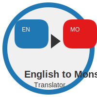

# English to Monsu Translator

## Overview

The **English to Monsu Translator** is a Python-based program that translates English sentences into a fictional language called "Monsu." The translation is achieved by mapping each English word to its Monsu equivalent using a dictionary.

This project is useful for anyone looking to understand how simple language translation works at a basic level. It can also be used as a foundation to build more complex translators or language learning tools.

## Features

- **Word-by-word translation**: Translates individual English words to Monsu based on a predefined dictionary.
- **Extensible dictionary**: Easily expand the dictionary with new English-to-Monsu word mappings.
- **Preserves unknown words**: If a word is not in the Monsu dictionary, it remains unchanged in the translated output.
- **Case insensitive**: Automatically handles both uppercase and lowercase inputs.

## How the Translation Works

The translation works by splitting the input English sentence into individual words, then checking if each word exists in the predefined `english_to_monsu` dictionary. If the word exists, it is replaced by its Monsu equivalent. If not, the word remains unchanged. Finally, the translated words are joined back into a sentence and displayed.

### Key Concepts:
- **Dictionary-based translation**: The heart of this project is the `english_to_monsu` dictionary, which maps English words to Monsu words.
- **Text Processing**: The input is processed using basic string operations such as `.split()` to break sentences into words, and `.join()` to reconstruct the sentence after translation.
- **Case handling**: All input is converted to lowercase using `.lower()` to ensure consistent translations, regardless of how the user inputs the text.

## Code Walkthrough

### 1. **Dictionary Setup**
The project starts by defining a dictionary `english_to_monsu` where each key-value pair corresponds to an English word and its Monsu translation.
```python
english_to_monsu = {
    'hello': 'monsu_1',
    'world': 'monsu_2',
    'python': 'monsu_8',
    # Add more mappings here
}
```

### 2. **Translation Function**
The main function `english_to_monsu_translator` processes the input text. It splits the text into words, translates each word by looking it up in the dictionary, and then reconstructs the sentence.

```python
def english_to_monsu_translator(text):
    words = text.lower().split()  # Split input into words
    translated_words = []

    for word in words:
        # Translate word if found in the dictionary, else keep it unchanged
        translated_word = english_to_monsu.get(word, word)
        translated_words.append(translated_word)

    return ' '.join(translated_words)  # Return the translated sentence
```

### 3. **Example Usage**
A simple usage of the translator with sample input:
```python
english_text = "Hello world this is a test"
monsu_translation = english_to_monsu_translator(english_text)
print("Original:", english_text)
print("Translated to Monsu:", monsu_translation)
```

### 4. **Expanding the Dictionary**
You can extend the `english_to_monsu` dictionary with additional words as needed:
```python
english_to_monsu.update({
    'school': 'monsu_51',
    'teacher': 'monsu_52',
    'student': 'monsu_53',
})
```

## Installation

### Requirements
- Python 3.x

### Installation Steps
1. Clone the repository (or download the script directly):
    ```bash
    git clone https://github.com/rkstudio 585/english-to-monsu-translator.git
    cd english-to-monsu-translator
    ```

2. Run the Python script:
    ```bash
    python translator.py
    ```

3. Enter your English text, and the Monsu translation will be displayed.

## Usage

Simply run the Python script and input any English sentence you want to translate. The script will output the sentence translated into Monsu based on the dictionary provided.

Example:
```bash
$ python translator.py
Enter text to translate: Hello world this is Python code
Translated text: monsu_1 monsu_2 monsu_3 monsu_4 monsu_8 monsu_9
```

You can also expand the `english_to_monsu` dictionary by adding more key-value pairs for additional words.

## Customization

To make the translator more robust or specific, you can:
1. **Expand the dictionary**: Add more words or phrases to `english_to_monsu` based on your use case.
2. **Handle punctuation**: Currently, the translator works with plain words. You can add functionality to handle punctuation marks like commas, periods, etc.
3. **Complex translations**: For more advanced use cases, consider implementing grammatical rules, sentence structure adjustments, or context-aware translations.

## Contributing

If you'd like to contribute to the project, feel free to fork the repository and submit pull requests. Contributions like adding more words to the dictionary, improving translation rules, or adding new features are always welcome!


---
